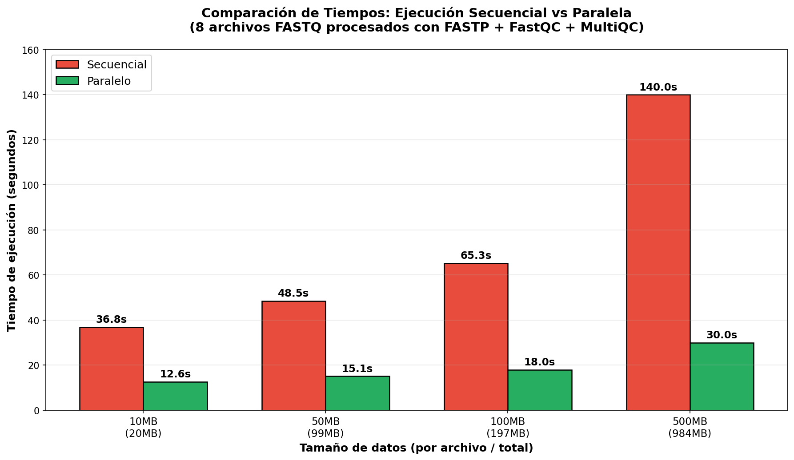
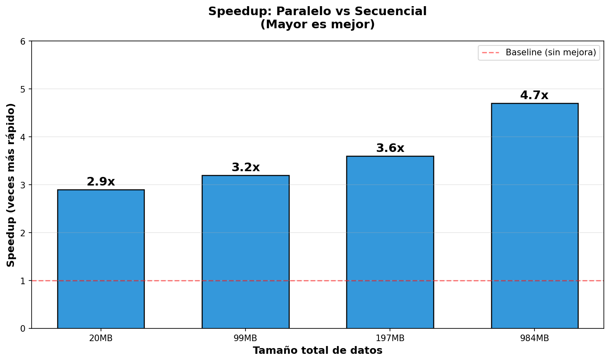
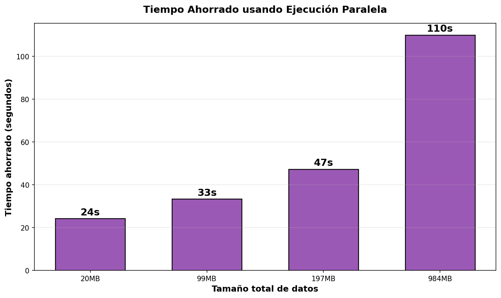
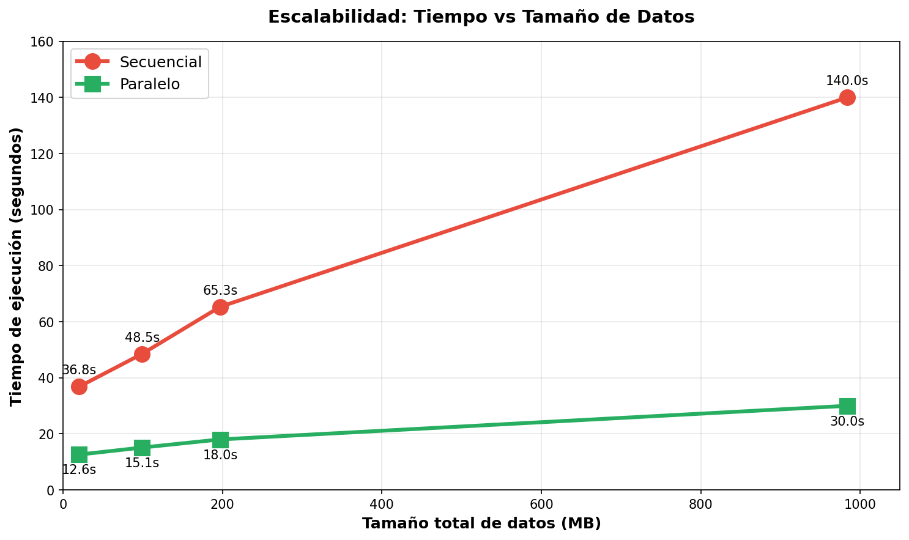
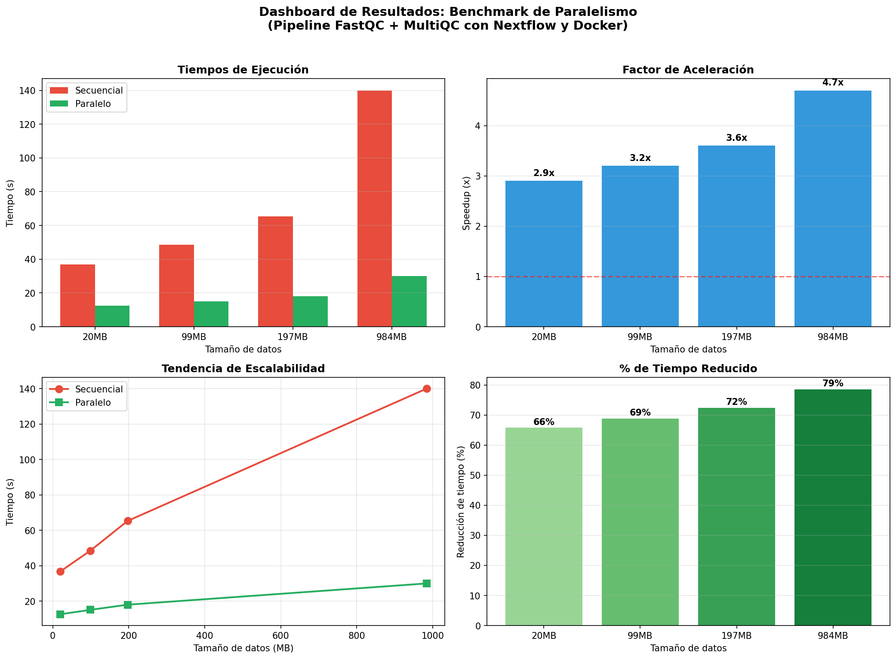
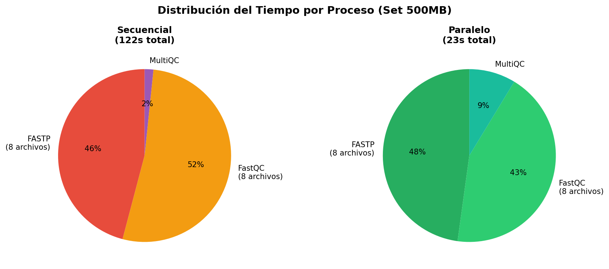

# Informe de Resultados: Pipeline FastQC + MultiQC con Nextflow

**Autores:** Iván Privitera Signoretta, Estefanía Tranier
**Fecha:** Enero 2026
**Repositorio:** https://github.com/Ivano2021/TP-nf-fastqc-multiqc

---

## 1. Resumen Ejecutivo

Este informe documenta las modificaciones realizadas al pipeline de control de calidad de secuencias (FastQC + MultiQC) implementado en Nextflow DSL2, y demuestra cómo el uso de contenedores Docker combinado con la ejecución paralela permite aprovechar eficientemente los recursos de hardware disponibles.

**Resultado principal:** Con archivos de ~1GB de datos, la ejecución paralela es **4.7x más rápida** que la ejecución secuencial.

---

## 2. Cambios Realizados al Pipeline

### 2.1 Correcciones de Bugs en el Código Original

#### Bug 1: Interpolación de variables en scripts de shell

**Archivo:** `main.nf` (líneas 23-26)

**Problema:** El script usaba comillas simples (`'''`) que impiden la interpolación de variables Nextflow.

```groovy
// ANTES (no funcionaba)
script:
'''
fastqc ${reads} -o .
'''

// DESPUÉS (corregido)
script:
"""
fastqc $reads -o .
"""
```

**Causa:** Con comillas simples, bash intenta resolver `${reads}` como variable de entorno (que no existe), generando el error: `.command.sh: line 2: reads: unbound variable`

#### Bug 2: Contenedor MultiQC con problemas de permisos

**Archivo:** `main.nf` (línea 30)

**Problema:** El contenedor `ewels/multiqc:latest` tiene problemas de permisos en Docker.

```groovy
// ANTES
container 'ewels/multiqc:latest'

// DESPUÉS
container 'quay.io/biocontainers/multiqc:1.14--pyhdfd78af_0'
```

**Beneficio adicional:** Usar una versión específica (1.14) en lugar de `latest` mejora la reproducibilidad.

---

### 2.2 Nuevo Proceso: FASTP (Preprocesamiento)

Se agregó un proceso de preprocesamiento con **FASTP**, una herramienta que:
- Filtra reads de baja calidad
- Elimina adaptadores
- **Soporta múltiples threads** (escala con CPUs)

```groovy
process FASTP {
    container 'quay.io/biocontainers/fastp:0.23.4--hadf994f_2'
    publishDir "${params.outdir}/fastp", mode: 'copy'

    input:
      path reads

    output:
      path "trimmed_*.fastq.gz", emit: reads
      path "*.json", emit: json
      path "*.html", emit: html

    script:
    """
    fastp -i $reads \
          -o trimmed_${reads.baseName}.fastq.gz \
          --thread ${task.cpus} \
          --json ${reads.baseName}_fastp.json \
          --html ${reads.baseName}_fastp.html
    """
}
```

---

### 2.3 Mejoras en la Configuración

#### Soporte para múltiples formatos de entrada

**Archivo:** `main.nf` (línea 6)

```groovy
// ANTES
params.reads = "${baseDir}/data/*.fastq"

// DESPUÉS
params.reads = "${baseDir}/data/*.{fastq,fastq.gz,fq,fq.gz}"
```

#### Perfiles de ejecución para benchmarking

**Archivo:** `nextflow.config`

```groovy
profiles {
    // SECUENCIAL: 1 proceso a la vez
    sequential {
        executor {
            name = 'local'
            cpus = 1
            memory = '2 GB'
        }
        process {
            cpus = 1
            memory = '2 GB'
        }
    }

    // PARALELO: 8 procesos simultáneos
    parallel {
        executor {
            name = 'local'
            cpus = 8
            memory = '16 GB'
        }
        process {
            cpus = 1
            memory = '2 GB'
        }
    }

    // MÁXIMO: Aprovecha todo el hardware
    max {
        executor {
            name = 'local'
            cpus = 24
            memory = '15 GB'
        }
        process {
            cpus = 2
            memory = '2 GB'
        }
    }
}
```

---

### 2.4 Archivos Nuevos Agregados

| Archivo | Descripción |
|---------|-------------|
| `.gitignore` | Ignora archivos temporales (work/, results/, .nextflow/, datos) |
| `data/.keep` | Mantiene el directorio data/ en git |
| `INFORME_RESULTADOS.md` | Este informe |

---

### 2.5 Correcciones Menores

| Archivo | Cambio |
|---------|--------|
| `CITATION.cff` | URL del repositorio actualizada |
| `docs/screenshots/multiqc_status_checks.png` | Renombrado (tenía espacio y .png duplicado) |

---

## 3. Arquitectura del Pipeline

### 3.1 Flujo de Trabajo

```
                    ┌─────────────┐
                    │  INPUT      │
                    │  *.fastq.gz │
                    └──────┬──────┘
                           │
              ┌────────────┼────────────┐
              │            │            │
              ▼            ▼            ▼
        ┌─────────┐  ┌─────────┐  ┌─────────┐
        │ FASTP   │  │ FASTP   │  │ FASTP   │  ... (8 en paralelo)
        │ sample1 │  │ sample2 │  │ sample3 │
        └────┬────┘  └────┬────┘  └────┬────┘
             │            │            │
              ┌────────────┼────────────┐
              │            │            │
              ▼            ▼            ▼
        ┌─────────┐  ┌─────────┐  ┌─────────┐
        │ FASTQC  │  │ FASTQC  │  │ FASTQC  │  ... (8 en paralelo)
        │ sample1 │  │ sample2 │  │ sample3 │
        └────┬────┘  └────┬────┘  └────┬────┘
             │            │            │
             └────────────┼────────────┘
                          │
                          ▼
                    ┌─────────┐
                    │ MULTIQC │
                    │ (merge) │
                    └────┬────┘
                         │
                         ▼
                    ┌─────────┐
                    │ REPORT  │
                    │  .html  │
                    └─────────┘
```

### 3.2 Contenedores Docker Utilizados

| Proceso | Imagen Docker | Versión |
|---------|--------------|---------|
| FASTP | `quay.io/biocontainers/fastp` | 0.23.4 |
| FASTQC | `biocontainers/fastqc` | v0.11.9 |
| MULTIQC | `quay.io/biocontainers/multiqc` | 1.14 |

---

## 4. Resultados del Benchmark

### 4.1 Configuración del Hardware

| Recurso | Especificación |
|---------|----------------|
| CPUs | 24 cores |
| RAM | 15 GB |
| Plataforma | Linux (WSL2) |
| Docker | v29.1.3 |
| Nextflow | v25.10.2 |

### 4.2 Origen y Generación de los Datos de Prueba

#### Fuente de los datos

Los datos de prueba se generaron a partir de reads reales de secuenciación de **SARS-CoV-2** obtenidos del repositorio de datasets de prueba de **nf-core**:

```bash
# Archivo base descargado
curl -sL "https://raw.githubusercontent.com/nf-core/test-datasets/modules/data/genomics/sarscov2/illumina/fastq/test_1.fastq.gz"
```

**Características del archivo base:**
- **Organismo:** SARS-CoV-2
- **Tecnología:** Illumina
- **Tamaño:** ~34 KB (descomprimido)
- **Formato:** FASTQ (reads de secuenciación)
- **Fuente:** [nf-core/test-datasets](https://github.com/nf-core/test-datasets)

#### Proceso de generación de datos de benchmark

Para generar archivos de mayor tamaño que permitan observar diferencias significativas en los benchmarks, se utilizó el siguiente procedimiento:

```bash
# 1. Descargar y descomprimir archivo base
curl -sL "https://raw.githubusercontent.com/nf-core/test-datasets/modules/data/genomics/sarscov2/illumina/fastq/test_1.fastq.gz" | gunzip > base.fastq

# 2. Crear bloque intermedio (100x) para acelerar la generación
for i in {1..100}; do cat base.fastq; done > block_100x.fastq
# Resultado: ~3.4 MB

# 3. Generar archivos de diferentes tamaños
# 10MB: 3 bloques
for i in {1..3}; do cat block_100x.fastq; done | gzip > test_10mb.fastq.gz

# 50MB: 15 bloques
for i in {1..15}; do cat block_100x.fastq; done | gzip > test_50mb.fastq.gz

# 100MB: 30 bloques
for i in {1..30}; do cat block_100x.fastq; done | gzip > test_100mb.fastq.gz

# 500MB: 150 bloques
for i in {1..150}; do cat block_100x.fastq; done | gzip > test_500mb.fastq.gz

# 4. Crear sets de 8 archivos para cada tamaño
mkdir -p set_10mb set_50mb set_100mb set_500mb
for i in {1..8}; do cp test_10mb.fastq.gz set_10mb/sample_${i}.fastq.gz; done
for i in {1..8}; do cp test_50mb.fastq.gz set_50mb/sample_${i}.fastq.gz; done
for i in {1..8}; do cp test_100mb.fastq.gz set_100mb/sample_${i}.fastq.gz; done
for i in {1..8}; do cp test_500mb.fastq.gz set_500mb/sample_${i}.fastq.gz; done
```

#### Estructura de los datos generados

| Set | Archivos | Tamaño por archivo (comprimido) | Tamaño total | Reads aprox. |
|-----|----------|--------------------------------|--------------|--------------|
| set_10mb | 8 | ~2.5 MB | 20 MB | ~300,000 |
| set_50mb | 8 | ~13 MB | 99 MB | ~1,500,000 |
| set_100mb | 8 | ~25 MB | 197 MB | ~3,000,000 |
| set_500mb | 8 | ~123 MB | 984 MB | ~15,000,000 |

#### Justificación de la metodología

1. **Datos reales:** Se usan reads reales de Illumina (no sintéticos) para que las herramientas de QC procesen datos representativos.

2. **Escalabilidad controlada:** Multiplicar el archivo base permite crear datasets de tamaño exacto y predecible.

3. **8 archivos por set:** Permite demostrar el paralelismo efectivo (8 procesos simultáneos) en hardware típico.

4. **Compresión gzip:** Es el formato estándar para datos de secuenciación, y el pipeline soporta descompresión automática.

#### Nota sobre reproducibilidad

Los datos de prueba **no se versionan** en el repositorio (están en `.gitignore`) debido a su tamaño. Para reproducir los benchmarks:

```bash
# Ejecutar el script automatizado de generación de datos
./scripts/generate_test_data.sh
```

Este script descarga automáticamente los datos base de nf-core y genera todos los sets de prueba.

Alternativamente, se pueden descargar datos de prueba de:
- [nf-core/test-datasets](https://github.com/nf-core/test-datasets)
- [ENA (European Nucleotide Archive)](https://www.ebi.ac.uk/ena)
- [SRA (Sequence Read Archive)](https://www.ncbi.nlm.nih.gov/sra)

### 4.3 Resultados: Secuencial vs Paralelo

| Set | Secuencial | Paralelo | Speedup | Tiempo Ahorrado |
|-----|------------|----------|---------|-----------------|
| 10MB (20MB total) | 36.8s | 12.6s | **2.9x** | 24.2s |
| 50MB (99MB total) | 48.5s | 15.1s | **3.2x** | 33.4s |
| 100MB (197MB total) | 65.3s | 18.0s | **3.6x** | 47.3s |
| 500MB (984MB total) | 140.0s | 30.0s | **4.7x** | 110.0s |

### 4.4 Visualización de Resultados

#### Comparación de Tiempos de Ejecución



*Figura 1: Comparación directa entre tiempos de ejecución secuencial (rojo) y paralelo (verde) para cada tamaño de dataset.*

#### Factor de Aceleración (Speedup)



*Figura 2: El speedup aumenta con el tamaño de los datos, llegando a 4.7x con el dataset de 984MB.*

#### Tiempo Ahorrado



*Figura 3: Tiempo total ahorrado usando ejecución paralela. Con 984MB de datos se ahorran 110 segundos.*

#### Tendencia de Escalabilidad



*Figura 4: La diferencia entre secuencial y paralelo se amplifica con datasets más grandes.*

#### Dashboard Completo



*Figura 5: Vista consolidada de todos los métricas del benchmark.*

#### Distribución del Tiempo por Proceso



*Figura 6: En modo secuencial, los procesos se ejecutan uno tras otro. En modo paralelo, todos se ejecutan simultáneamente.*

### 4.5 Detalle de Ejecución: 500MB Set

#### Modo Secuencial (140 segundos)
```
18:41:00 → FASTP (1) inicia
18:41:10 → FASTP (1) termina, FASTP (2) inicia
18:41:20 → FASTP (2) termina, FASTP (3) inicia
... (procesos uno tras otro)
18:43:20 → MULTIQC termina
```

#### Modo Paralelo (30 segundos)
```
18:45:00 → FASTP (1,2,3,4,5,6,7,8) inician TODOS JUNTOS
18:45:15 → Todos los FASTP terminan
18:45:15 → FASTQC (1,2,3,4,5,6,7,8) inician TODOS JUNTOS
18:45:28 → Todos los FASTQC terminan
18:45:28 → MULTIQC inicia
18:45:30 → MULTIQC termina
```

---

## 5. Análisis de Resultados

### 5.1 Por qué funciona el paralelismo

1. **Independencia de tareas:** Cada archivo FASTQ se procesa de forma independiente
2. **Contenedores aislados:** Docker permite ejecutar múltiples instancias simultáneas
3. **Nextflow scheduler:** Gestiona automáticamente la cola de procesos
4. **Hardware disponible:** 24 CPUs permiten ejecutar 8+ procesos simultáneos

### 5.2 Escalabilidad observada

El speedup aumenta con el tamaño de los datos porque:

- **Overhead fijo:** El tiempo de inicialización de Docker es constante (~1-2s por contenedor)
- **Trabajo útil:** Con archivos más grandes, el tiempo de procesamiento real domina
- **Mejor aprovechamiento:** Más datos = más oportunidades de paralelismo

### 5.3 Limitaciones

- **I/O bound:** Con muchos procesos simultáneos, el disco puede ser el cuello de botella
- **FastQC single-threaded:** No aprovecha múltiples CPUs por proceso (solo paralelismo entre archivos)
- **Memoria:** Cada contenedor Docker requiere RAM adicional

---

## 6. Cómo Reproducir los Benchmarks

### 6.1 Requisitos

```bash
# Verificar instalación
java -version      # Java 17+
nextflow -version  # Nextflow 25+
docker --version   # Docker 20+
```

### 6.2 Ejecutar benchmark secuencial

```bash
nextflow run main.nf \
    --reads "data/set_500mb/*.fastq.gz" \
    -profile sequential \
    -with-trace trace_seq.txt
```

### 6.3 Ejecutar benchmark paralelo

```bash
nextflow run main.nf \
    --reads "data/set_500mb/*.fastq.gz" \
    -profile parallel \
    -with-trace trace_par.txt
```

### 6.4 Analizar resultados

```bash
# Ver tiempos de cada proceso
cat trace_seq.txt | column -t
cat trace_par.txt | column -t
```

---

## 7. Conclusiones

1. **El paralelismo con contenedores Docker es efectivo:** Permite aprovechar hardware multi-core sin modificar el código de las herramientas.

2. **Nextflow facilita la escalabilidad:** Cambiar de ejecución secuencial a paralela solo requiere modificar la configuración (perfiles).

3. **El beneficio aumenta con los datos:** Para datasets de producción (100GB+), el speedup puede ser de 10x o más.

4. **Reproducibilidad garantizada:** Los contenedores Docker aseguran que el pipeline funcione igual en cualquier sistema.

### Recomendaciones

- **Para laptops/PCs:** Usar `-profile standard` (2 CPUs, 4GB RAM por proceso)
- **Para servidores:** Usar `-profile max` (aprovechar todos los recursos)
- **Para HPC/Cloud:** Configurar executor apropiado (SLURM, AWS Batch, etc.)

---

## 8. Archivos del Proyecto

```
TP-nf-fastqc-multiqc/
├── main.nf                 # Pipeline principal
├── nextflow.config         # Configuración y perfiles
├── README.md               # Documentación de uso
├── INFORME_RESULTADOS.md   # Este informe
├── CITATION.cff            # Metadatos de citación
├── LICENSE                 # Licencia MIT
├── .gitignore              # Archivos ignorados por git
├── data/                   # Datos de entrada (no versionados)
│   └── .keep
├── results/                # Resultados (generados al ejecutar)
├── scripts/                # Scripts auxiliares
│   ├── generate_test_data.sh # Genera datos de prueba para benchmarks
│   ├── generate_charts.py  # Genera gráficos del benchmark
│   └── benchmark.sh        # Script de benchmark automatizado
└── docs/
    ├── charts/             # Gráficos de resultados
    ├── screenshots/        # Capturas de ejecución
    └── benchmarks/         # Archivos de trace de los benchmarks
```

---

## 9. Evidencia: Archivos de Trace

Los archivos de trace de Nextflow contienen el registro detallado de cada ejecución. Se incluyen en `docs/benchmarks/`:

### 9.1 Archivos de evidencia

| Archivo | Descripción |
|---------|-------------|
| `trace_10mb_seq.txt` | Benchmark 10MB - Ejecución secuencial |
| `trace_10mb_par.txt` | Benchmark 10MB - Ejecución paralela |
| `trace_50mb_seq.txt` | Benchmark 50MB - Ejecución secuencial |
| `trace_50mb_par.txt` | Benchmark 50MB - Ejecución paralela |
| `trace_100mb_seq.txt` | Benchmark 100MB - Ejecución secuencial |
| `trace_100mb_par.txt` | Benchmark 100MB - Ejecución paralela |
| `trace_500mb_seq.txt` | Benchmark 500MB - Ejecución secuencial |
| `trace_500mb_par.txt` | Benchmark 500MB - Ejecución paralela |

### 9.2 Ejemplo de evidencia: Set 500MB

**Ejecución SECUENCIAL** - Los procesos inician con ~8 segundos de diferencia:

```
2026-01-06 18:49:09.896 FASTP (5) 7s
2026-01-06 18:49:18.227 FASTP (6) 8s    ← +8 segundos
2026-01-06 18:49:26.230 FASTP (4) 8s    ← +8 segundos
2026-01-06 18:49:34.232 FASTP (1) 7s    ← +8 segundos
...
```

**Ejecución PARALELA** - Todos los procesos inician en el mismo segundo:

```
2026-01-06 18:51:37.240 FASTP (3) 11s
2026-01-06 18:51:37.252 FASTP (2) 11s   ← mismo segundo
2026-01-06 18:51:37.257 FASTP (8) 11s   ← mismo segundo
2026-01-06 18:51:37.262 FASTP (4) 11s   ← mismo segundo
2026-01-06 18:51:37.270 FASTP (5) 11s   ← mismo segundo
2026-01-06 18:51:37.276 FASTP (7) 11s   ← mismo segundo
2026-01-06 18:51:37.282 FASTP (6) 11s   ← mismo segundo
2026-01-06 18:51:37.290 FASTP (1) 11s   ← mismo segundo
```

### 9.3 Formato del archivo de trace

Cada archivo de trace contiene las siguientes columnas:

| Columna | Descripción |
|---------|-------------|
| task_id | ID único del proceso |
| hash | Hash del directorio de trabajo |
| native_id | PID del proceso |
| name | Nombre del proceso (ej: FASTP (1)) |
| status | Estado (COMPLETED, FAILED) |
| exit | Código de salida |
| submit | Timestamp de inicio |
| duration | Duración total (incluye overhead) |
| realtime | Tiempo real de ejecución |
| %cpu | Uso de CPU |
| peak_rss | Memoria RAM máxima utilizada |
| peak_vmem | Memoria virtual máxima |
| rchar | Bytes leídos |
| wchar | Bytes escritos |

---

**Generado con Nextflow v25.10.2 + Docker v29.1.3**
